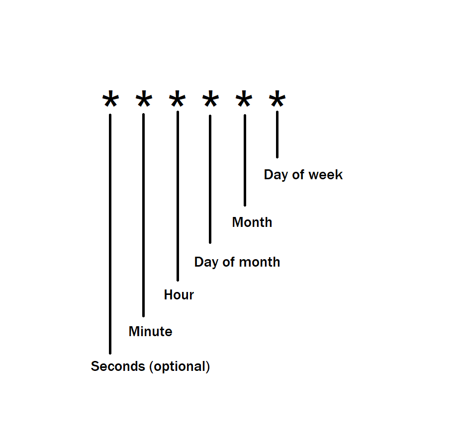
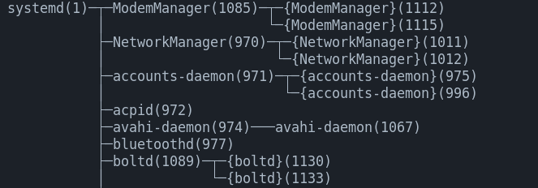

# Local Files Backup

A script that gives you the ability to make a backup for your files 24/7 by moving them from your local station into a hard drive/ remote server.

## Technologies :

* cron: Allow users to schedule the backup at specific intervals.
  * <p align="center"></p>
  * To learn more about cron ```https://crontab.guru/#*_*_*_*_*```

* rsync: Handle the copying and syncing of files (Available just on UNIX).
  * To learn more about rsync ```https://www.digitalocean.com/community/tutorials/how-to-use-rsync-to-sync-local-and-remote-directories```
  * List of rsync status codes ```https://stackoverflow.com/a/20738063```
  * Note that while running on Windows the status code doesn't necessarily match up with the rsync status codes, but the result is correct, the copying process was successful.

* robocopy : Handle the copying and syncing of files (For Windows).
  * To learn more about robocopy ```https://learn.microsoft.com/en-us/windows-server/administration/windows-commands/robocopy```

* nohup : NO HANG UP keep the processes running even after exiting the terminal.
  * Learn more about nohup ```https://en.wikipedia.org/wiki/Nohup```
  * View background process ```pstree -p```
  * Should give something similar to this (Tree Representation)
  * <p align="center"></p>
  * Execute this commande to tell the leading nohup will tell your system that even when your session ends you don't want the process to stop, and the final trailing & symbol means to run it as a background daemon process. ```nohup node backup.js &```
  * To kill the process  (-9 tells it to override anything that might stop or intercept a system kill signal) ```kill -9 YOUR_PID``` 

* pm2 : Enables us to keep running applications alive indefinitely (even when accidents occur). Learn more about pm2 ```https://pm2.keymetrics.io/```

  * View the process ```pm2 list```
  * stop the process ```pm2 stop backup```
  * view the logs ```pm2 logs backup```
